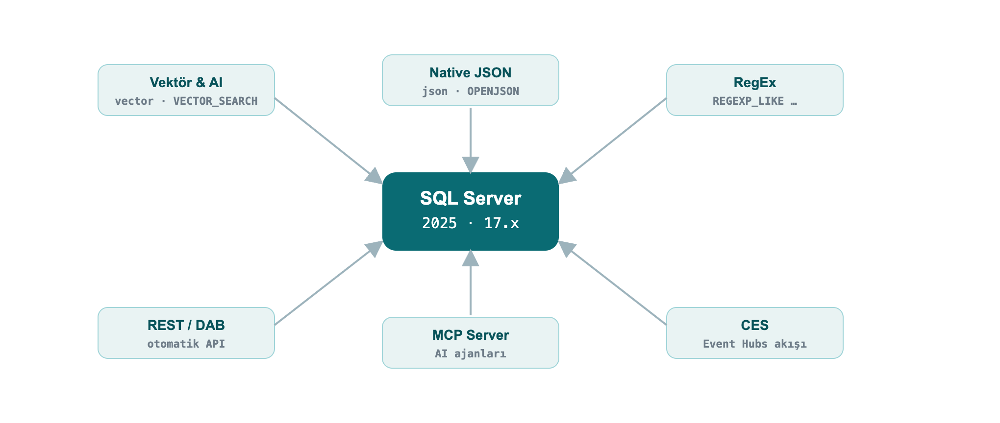
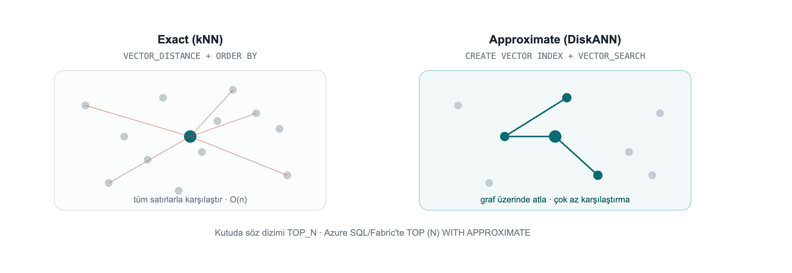
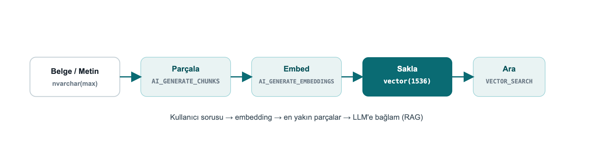
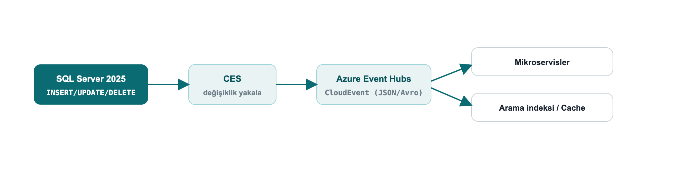
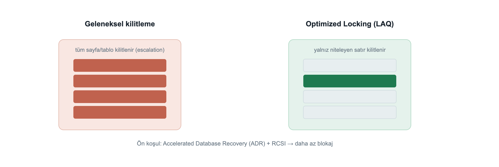
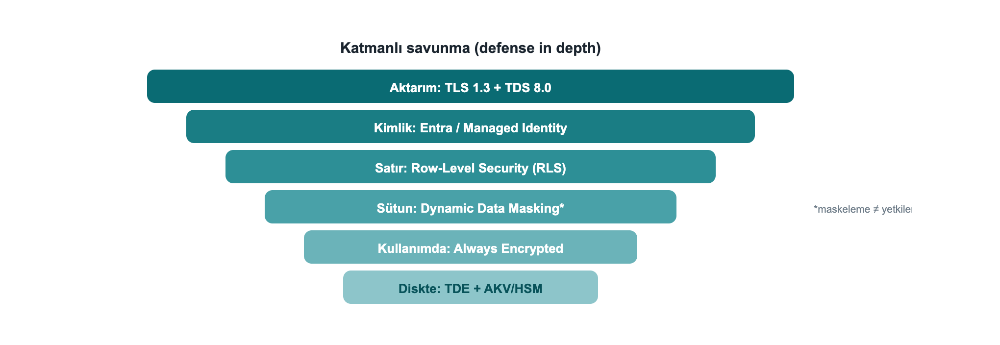

# Preface

When SQL Server 2025 shipped, what I most wanted to know was what actually changes in a developer's day behind the marketing headlines. Having lived with SQL Server for years, I know that "a new version is out" usually means "a few new flags, a few gotchas, and a lot of fine detail."

I wrote this book to live through that fine detail once, myself, and write it down. I ran nearly every example on a live SQL Server 2025 instance and marked, one by one, the places where the docs and the build diverge, or where a feature behaves differently on the box product versus the cloud. My goal is that you don't fall into the same traps after me.

This is not a DBA handbook; it is written from the perspective of **an engineer who builds applications**. You can read it front to back or jump to the chapter you need; each one stands on its own. Every example is runnable in the repository and is automatically re-verified on a real SQL Server 2025 on every push.

Enjoy the read.

Çağlar Özenç

# Part I · Foundations

*Set up the environment in 60 seconds, turn on the preview flags, and see how to read this book.*

# 1. Introduction: who this book is for

This ebook is written for **software developers, software specialists and SQL developers**. The goal is to explain SQL Server 2025 not from a DBA's angle but from the perspective of **an engineer who builds applications**: the new T-SQL capabilities, the features that turn the database into an AI application platform, and how to use them from .NET / EF Core / Python code.

**Nearly every example in this book was executed on a real SQL Server 2025 instance and is shown with its output.** The version used:

```out
Microsoft SQL Server 2025 (RTM-CU7) - 17.0.4065.4 (X64)
Enterprise Developer Edition (64-bit) on Linux (Ubuntu 24.04)
```

> **Why real output?** The syntax of preview features can diverge between the docs and a given build. By validating every example on a live engine, this book eliminates the "the docs said so but it didn't work" trap. Wherever the box product diverges from Azure SQL / Fabric, the difference is called out explicitly.

## 1.1 What changed: the 30-second summary

SQL Server 2025 (version **17.x**) is the broadest engine release since 2016. From a developer's point of view, the highlights are:

- **Built-in vector type and vector search**: for RAG / semantic search, with no separate vector database.
- **A real `json` data type**: the era of storing JSON inside `nvarchar(max)` is over.
- **RegEx inside the language**: pattern matching, extraction and validation without CLR.
- **Application integration**: REST calls from T-SQL, automatic REST/GraphQL (Data API Builder), an MCP server for AI agents, change streaming to Event Hubs (CES).
- **Concurrency**: Optimized Locking radically reduces blocking and lock memory.
- **Free developer editions**: Standard Developer and Enterprise Developer.



## 1.2 Set up the environment in 60 seconds with Docker

The command I used to set up my lab; the same one works for you:

```bash
docker run -e "ACCEPT_EULA=Y" -e "MSSQL_SA_PASSWORD=Strong#Passw0rd" \
  -e "MSSQL_PID=Developer" -p 1433:1433 --name sqldev2025 -d \
  mcr.microsoft.com/mssql/server:2025-latest
```

To connect, use `sqlcmd` (18+), **SSMS 21**, the **VS Code mssql extension** or Azure Data Studio. A quick test from inside the container:

```bash
docker exec -it sqldev2025 /opt/mssql-tools18/bin/sqlcmd \
  -S localhost -U sa -P 'Strong#Passw0rd' -C -No -Q "SELECT @@VERSION"
```

> **Note:** `-C -No` = trust the server certificate + do not force encryption. In production use a valid certificate; SQL Server 2025 supports **TLS 1.3 + TDS 8.0** on the wire.

## 1.3 Enable preview features and the compatibility level

Some features (vector index, CES, fuzzy matching, etc.) require a **database-scoped preview flag**. In addition, some new functions need **compatibility level 170** (such as `AI_GENERATE_CHUNKS`).

```sql
CREATE DATABASE DevBook;
ALTER DATABASE DevBook SET COMPATIBILITY_LEVEL = 170;
GO
-- Enable preview features (persisted on the database)
ALTER DATABASE SCOPED CONFIGURATION SET PREVIEW_FEATURES = ON;
```

Check:

```sql
SELECT name, value FROM sys.database_scoped_configurations WHERE name = 'PREVIEW_FEATURES';
```

```out
name              value
----------------  -----
PREVIEW_FEATURES  1
```

---

# Part II · AI and New Data Types

*Vector search, native JSON and RegEx inside the language. In this part the data itself changes: the database now stores embeddings, holds documents and matches patterns.*

# 2. AI and Vector Search

This is the headline of the release. SQL Server 2025 **stores, indexes and searches embeddings**; it can even **generate embeddings** from within T-SQL. You can build a RAG (retrieval-augmented generation) pipeline inside the database itself.

## 2.1 The `vector` data type and vector functions

`vector(n)` stores a fixed-length numeric array; it is kept in an optimized binary format but exposed like a JSON array. Each element uses single (4-byte, float32) precision.

```02-vector-funcs.sql
DECLARE @a vector(3) = '[1,2,3]', @b vector(3) = '[2,3,4]';
SELECT VECTOR_DISTANCE('cosine', @a, @b)     AS cosine_dist,
       VECTOR_DISTANCE('euclidean', @a, @b)  AS euclid_dist,
       VECTOR_NORM(@a, 'norm2')              AS l2norm,
       CAST(VECTOR_NORMALIZE(@a, 'norm2') AS varchar(64)) AS normalized;
```

```out
cosine_dist            euclid_dist          l2norm              normalized
---------------------  -------------------  ------------------  -------------------------------------------------
7.4167251586914062E-3  1.7320507764816284   3.7416573867739413  [2.6726124e-001,5.3452247e-001,8.0178368e-001]
```

`VECTOR_DISTANCE` supports three metrics: `'cosine'`, `'euclidean'`, `'dot'`. You read a vector's properties with `VECTORPROPERTY`:

```sql
DECLARE @a vector(3) = '[1,2,3]';
SELECT VECTORPROPERTY(@a,'Dimensions') AS dims, VECTORPROPERTY(@a,'BaseType') AS basetype;
```

```out
dims  basetype
----  --------
3     float32
```

## 2.2 Exact (kNN) search: the safe path that works everywhere

Finding nearest neighbors needs no index: `VECTOR_DISTANCE` + `ORDER BY` performs an **exact (kNN)** search. It works on small-medium sets and on every edition (box + Azure + Fabric).

```03-exact-knn.sql
DECLARE @qv vector(5) = '[0.3,0.3,0.3,0.3,0.3]';
SELECT TOP (3) id, title, VECTOR_DISTANCE('cosine', embedding, @qv) AS dist
FROM dbo.Articles
ORDER BY dist;
```

```out
id  title       dist
--  ----------  -------------------
15  Article 15  0.09546583890914917
30  Article 30  0.09546583890914917
49  Article 49  0.09546583890914917
```

**Field example: similar support tickets.** When a new support ticket arrives, finding similar tickets resolved in the past shortens resolution time. You keep each ticket's embedding in a `vector` column, embed the incoming ticket with the same model, and pull the nearest neighbors:

```field-tickets.sql
CREATE TABLE dbo.Tickets (id int PRIMARY KEY, subject nvarchar(60), v vector(3));
INSERT dbo.Tickets VALUES
 (1,'Query runs very slowly','[0.90,0.10,0.05]'),
 (2,'App cannot connect to the database','[0.10,0.90,0.10]'),
 (3,'Report screen opens late','[0.82,0.18,0.08]'),
 (4,'Nightly backup failed','[0.08,0.12,0.90]');

-- New ticket is performance-themed; the 2 most similar past tickets
DECLARE @new vector(3) = '[0.88,0.12,0.06]';
SELECT TOP 2 id, subject, ROUND(VECTOR_DISTANCE('cosine', v, @new), 4) AS distance
FROM dbo.Tickets ORDER BY distance;
```

```out
id  subject                   distance
--  ------------------------  --------
1   Query runs very slowly    0.0004
3   Report screen opens late  0.0036
```

The performance-themed ticket returned the two performance tickets, not the connection or backup ones. In reality you use `vector(384)`/`vector(1536)` from an embedding model instead of `vector(3)` (see Chapter 11.4).

## 2.3 Approximate (ANN) search: the DiskANN vector index

On millions of rows an exact scan is expensive. A **DiskANN**-based vector index makes it scalable with approximate nearest neighbor (ANN) search.



While trying it I hit four practical traps, in order:

**Trap 1, the preview flag.** The vector index + `VECTOR_SEARCH` is in preview on the box product: `PREVIEW_FEATURES = ON` is required (not needed on Azure SQL DB / Fabric SQL).

**Trap 2, `SET QUOTED_IDENTIFIER ON`.** If this option is off, index creation fails with **Msg 1934** (it is off by default in sqlcmd; on in SSMS):

```out real error: with QUOTED_IDENTIFIER off
Msg 1934, Level 16: CREATE VECTOR INDEX failed because the following SET
options have incorrect settings: 'QUOTED_IDENTIFIER'.
```

The correct setup:

```04-vector-index.sql
SET QUOTED_IDENTIFIER ON;

-- At least 100 rows are required; the embeddings are generated for the example
CREATE TABLE dbo.Articles (id int PRIMARY KEY, title nvarchar(100), embedding vector(5));
INSERT dbo.Articles (id, title, embedding)
SELECT value, 'Article ' || value,
       CAST(JSON_ARRAY(value*0.01, value*0.02, value*0.03, value*0.04, value*0.05) AS vector(5))
FROM GENERATE_SERIES(1, 100);

CREATE VECTOR INDEX vec_idx ON dbo.Articles(embedding)
WITH (METRIC = 'cosine', TYPE = 'diskann');

SELECT name, type_desc FROM sys.vector_indexes;
```

```out
name     type_desc
-------  ---------
vec_idx  VECTOR
```

**Trap 3, the syntax is `TOP_N` on the box, `WITH APPROXIMATE` on Azure/Fabric.** This was the most important thing I found. The newer `SELECT TOP (N) WITH APPROXIMATE` syntax is for **"latest version indexes"** and currently exists **only on Azure SQL Database and Fabric SQL**. On the SQL Server 2025 box product (CU7), trying it gives:

```out real error: WITH APPROXIMATE on the box product
Msg 102, Level 15: Incorrect syntax near 'APPROXIMATE'.
```

On the box product you call **the `VECTOR_SEARCH` function with the `TOP_N` parameter**.

**Trap 4, the alias rule.** You reference table columns with the **table alias** (`t`) and the produced `distance` column with the **result alias** (`s`); mixing them yields "Invalid column name".

```05-vector-search-box.sql
SET QUOTED_IDENTIFIER ON;
DECLARE @qv vector(5) = '[0.3,0.3,0.3,0.3,0.3]';

SELECT t.id, t.title, s.distance
FROM VECTOR_SEARCH(
        TABLE      = dbo.Articles AS t,   -- table alias: t
        COLUMN     = embedding,
        SIMILAR_TO = @qv,
        METRIC     = 'cosine',
        TOP_N      = 3) AS s              -- result alias: s
ORDER BY s.distance;
```

```out
id  title      distance
--  ---------  ---------------------
1   Article 1  9.5465958118438721E-2
2   Article 2  9.5465958118438721E-2
3   Article 3  9.5465958118438721E-2
```

> **On Azure SQL DB / Fabric SQL** the same query with a "latest version" index is written with `TOP (N) WITH APPROXIMATE` instead of `TOP_N`, and `ORDER BY` must be `distance` ASC only: `SELECT TOP (3) WITH APPROXIMATE t.id, s.distance FROM VECTOR_SEARCH(TABLE = ... AS t, COLUMN = ..., SIMILAR_TO = @qv, METRIC = 'cosine') AS s ORDER BY s.distance;`. Latest-version indexes also bring **full DML** (INSERT/UPDATE/DELETE) and **iterative filtering** (WHERE applied during the search); earlier indexes made the table read-only and applied filters after the search.


## 2.4 Generate embeddings inside the database

`CREATE EXTERNAL MODEL` defines an AI inference endpoint (Azure OpenAI, OpenAI, Ollama, ONNX Runtime) as a database object; `AI_GENERATE_EMBEDDINGS` generates embeddings with that model. With Managed Identity you authenticate **without storing any key**.

```06-external-model.sql
-- Prerequisite: enable outbound REST calls (on by default on Azure SQL DB / Fabric)
EXEC sp_configure 'external rest endpoint enabled', 1; RECONFIGURE WITH OVERRIDE;

-- Managed-Identity-based credential (the secret field is required)
CREATE DATABASE SCOPED CREDENTIAL [https://my-aoai.cognitiveservices.azure.com/]
    WITH IDENTITY = 'Managed Identity',
         secret   = '{"resourceid":"https://cognitiveservices.azure.com"}';

CREATE EXTERNAL MODEL AzureEmbed WITH (
    LOCATION   = 'https://my-aoai.cognitiveservices.azure.com/openai/deployments/text-embedding-3-small/embeddings?api-version=2024-02-01',
    API_FORMAT = 'Azure OpenAI',
    MODEL_TYPE = EMBEDDINGS,
    MODEL      = 'text-embedding-3-small',
    CREDENTIAL = [https://my-aoai.cognitiveservices.azure.com/]);
```

> **Note:** The credential name must exactly match the `LOCATION` protocol + host. The only valid `MODEL_TYPE` today is `EMBEDDINGS`. Accepted `API_FORMAT` values: `Azure OpenAI`, `OpenAI`, `Ollama`, `ONNX Runtime` (with ONNX you can run locally, offline).

> **HTTPS is required (verified live):** The engine only allows **HTTPS/TLS** endpoints. When I pointed it at an HTTP Ollama endpoint, it was rejected outright:
>
> `Msg 31610 … Accessing the external endpoint is only allowed via HTTPS.`
>
> If you use a local model (Ollama/ONNX), put the endpoint behind **TLS with a valid/trusted certificate**; in practice most teams point `LOCATION` directly at **Azure OpenAI**.

### Live verification: generating embeddings inside the engine

I ran `AI_GENERATE_EMBEDDINGS` **in two end-to-end scenarios myself.** In both, the engine generated the embedding itself and wrote it into a `vector` column, then embedded the question with the same model and searched with `VECTOR_DISTANCE`.

**A) Azure OpenAI (the production path).** `text-embedding-3-small` (1536 dims), authenticated with `HTTPEndpointHeaders` (api-key):

```29-aoai-embed.sql
CREATE TABLE dbo.Kb (id int IDENTITY PRIMARY KEY, chunk nvarchar(200), emb vector(1536));
INSERT dbo.Kb (chunk, emb)
SELECT c.chunk, AI_GENERATE_EMBEDDINGS(c.chunk USE MODEL AzureEmbed)
FROM (VALUES (N'SQL Server 2025 offers a built-in vector type and DiskANN index for semantic search.'),
             (N'The native JSON type stores documents in a binary format.'),
             (N'Regular expressions provide pattern matching without CLR.')) c(chunk);

DECLARE @q vector(1536) = AI_GENERATE_EMBEDDINGS(N'how do I search text by meaning?' USE MODEL AzureEmbed);
SELECT TOP 2 id, LEFT(chunk,52) AS chunk, ROUND(VECTOR_DISTANCE('cosine', emb, @q), 4) AS dist
FROM dbo.Kb ORDER BY dist;
```

```out
id  chunk                                                 dist
--  ----------------------------------------------------  ------
1   SQL Server 2025 offers a built-in vector type and Di  0.7059
3   Regular expressions provide pattern matching without  0.8240
```

**B) A local model (Ollama), from inside the engine.** If you want to keep the model on your machine, one detail matters: SQL Server only allows a **trusted** HTTPS endpoint and **does not accept a self-signed certificate.** I tested this in detail: even when the container's OS trusts the cert (OpenSSL verification OK), the engine's REST client does not, and it returns `0x80070008` without ever sending the request. The fix: run Ollama on your machine and put a **trusted-certificate tunnel** (for example the free `cloudflared`) in front of it. The model stays entirely local; SQL only sees the tunnel's trusted certificate:

```30-local-ollama-embed.sql
-- In a terminal: ollama serve   +   cloudflared tunnel --url http://localhost:11434
CREATE EXTERNAL MODEL LocalOllama WITH (
  LOCATION = 'https://<tunnel-name>.trycloudflare.com/api/embed',
  API_FORMAT = 'Ollama', MODEL_TYPE = EMBEDDINGS, MODEL = 'all-minilm');

DECLARE @q vector(384) = AI_GENERATE_EMBEDDINGS(N'how do I find similar text by meaning?' USE MODEL LocalOllama);
SELECT TOP 2 id, LEFT(chunk,46) AS chunk, ROUND(VECTOR_DISTANCE('cosine', emb, @q), 4) AS dist
FROM dbo.KbLocal ORDER BY dist;
```

```out
id  chunk                                            dist
--  -----------------------------------------------  ------
1   SQL Server 2025 has a built-in vector type and   0.6912
3   Regular expressions match patterns without CLR   0.7352
```

In both scenarios the engine generated the embedding itself and the semantic search ran on the local SQL Server 2025. The only extra component the local path needs is a trusted-certificate tunnel, because SQL does not accept a self-signed one. (The demo in Chapter 11.4, by contrast, generates embeddings on the client side and loads them, so it needs no tunnel at all.)

## 2.5 Chunk text: `AI_GENERATE_CHUNKS`

For RAG you must split long text into model-sized chunks. `AI_GENERATE_CHUNKS` does this and is a **table-valued function**, used with `CROSS APPLY`, returning `chunk`, `chunk_order`, `chunk_offset`, `chunk_length` columns. It **requires no external endpoint**, so the output below is real:

```07-chunks.sql
SELECT c.chunk, c.chunk_order, c.chunk_length
FROM (VALUES (N'SQL Server 2025 brings built-in vector and JSON for developers.')) d(t)
CROSS APPLY AI_GENERATE_CHUNKS(SOURCE = d.t, CHUNK_TYPE = FIXED, CHUNK_SIZE = 25, OVERLAP = 0) AS c;
```

```out
chunk                       chunk_order  chunk_length
--------------------------  -----------  ------------
SQL Server 2025 brings bu   1            25
ilt-in vector and JSON fo   2            25
r developers.               3            13
```

With `OVERLAP` (a percentage 0-50) you overlap consecutive chunks to improve retrieval accuracy. The full RAG flow: `AI_GENERATE_CHUNKS` → `AI_GENERATE_EMBEDDINGS` → `INSERT` into a `vector(1536)` column → `VECTOR_DISTANCE`/`VECTOR_SEARCH` against the query vector.



## 2.6 Application side: .NET and EF Core

Native vectors travel over TDS with **`Microsoft.Data.SqlClient` 6.1.0+**; the `SqlVector<float>` type was added. **.NET 10** adds the `SqlDbType.Vector` enumeration. For older clients, SQL Server exposes vectors as `varchar(max)` to preserve backward compatibility.

**EF Core 10** fully supports vectors and `VECTOR_DISTANCE` (only on SQL Server 2025+):

```08-efcore.cs
public class Article
{
    public int Id { get; set; }
    public string Title { get; set; } = "";
    [Column(TypeName = "vector(1536)")]
    public SqlVector<float> Embedding { get; set; }
}
```

You run semantic search over LINQ with `EF.Functions.VectorDistance(...)`; the full connection string, query and Python examples are in **Chapter 8**.

> **Note:** Starting with EF Core 11, vector properties are **not loaded by default** in a query because they are large, you select them explicitly when needed. With Dapper too, `SqlVector<float>` binds directly as a parameter.

## 2.7 Exact or ANN?: a live measurement

Decisions need real numbers. I ran the same query 5 times each, exact (no index) and DiskANN ANN (`VECTOR_SEARCH`), over a **100,000-row, 16-dimension** table (warm cache):


- **Exact (kNN):** ~11-14 ms (median ~13 ms). Every query compares against all rows: O(n).
- **ANN (DiskANN):** ~4-5 ms (some warm calls <1 ms). It hops across a graph.

At this scale ANN is **~3× faster**; the real payoff grows **with row count and dimensionality** (with millions of rows at 768/1536 dims the gap becomes far larger). **Rule of thumb:** up to a few hundred thousand rows and modest latency needs, exact is enough and simpler; beyond that, move to a DiskANN index. ANN is *approximate*, if you need 100% precision, use exact.

> **Box-product note:** This ANN measurement used the box-product `VECTOR_SEARCH ... TOP_N` syntax; it needs `PREVIEW_FEATURES = ON` and `SET QUOTED_IDENTIFIER ON` (see Chapter 10, Troubleshooting).

---

# 3. Native JSON

There is now a real `json` data type: stored in binary, indexable, up to 2 GB per document. Read performance improves markedly over storing JSON inside `nvarchar(max)`, and the schema is validated by the engine.

## 3.1 Create and query a `json` column

```09-json-table.sql
CREATE TABLE dbo.Orders (Id int IDENTITY PRIMARY KEY, Doc json);
INSERT dbo.Orders (Doc) VALUES
 (N'{"customer":"Ada","total":1290.50,"items":["ssd","ram"],"paid":true}'),
 (N'{"customer":"Linus","total":540.00,"items":["kbd"],"paid":false}');

SELECT Id,
       JSON_VALUE(Doc, '$.customer')                       AS customer,
       CAST(JSON_VALUE(Doc, '$.total') AS decimal(10,2))   AS total,
       JSON_QUERY(Doc, '$.items')                          AS items,
       ISJSON(Doc)                                         AS is_valid
FROM dbo.Orders;
```

```out
Id  customer  total    items           is_valid
--  --------  -------  --------------  --------
1   Ada       1290.50  ["ssd","ram"]   1
2   Linus     540.00   ["kbd"]         1
```

`JSON_VALUE` returns a scalar value, `JSON_QUERY` an object/array. `ISJSON` tests whether a text is valid JSON.

## 3.2 Update a document: `JSON_MODIFY`

```10-json-modify.sql
UPDATE dbo.Orders SET Doc = JSON_MODIFY(Doc, '$.paid', 'true') WHERE Id = 2;
SELECT Id, JSON_VALUE(Doc, '$.paid') AS paid FROM dbo.Orders WHERE Id = 2;
```

```out
Id  paid
--  ----
2   true
```

> **Nuance:** If the value argument of `JSON_MODIFY` is a T-SQL string, it is written to JSON as a **string**: `JSON_MODIFY(Doc,'$.paid','true')` → `{"paid":"true"}`. For a real JSON boolean, pass the value with the right type: `JSON_MODIFY(Doc,'$.paid', CAST(1 AS bit))` → `{"paid":true}` (verified live).

## 3.3 Aggregate rows into JSON: `JSON_ARRAYAGG` / `JSON_OBJECTAGG`

The two new first-class aggregates of 2025 put an end to string-concatenation tricks:

```11-json-agg.sql
SELECT JSON_ARRAYAGG(JSON_VALUE(Doc,'$.customer')) AS customers,
       JSON_OBJECTAGG(JSON_VALUE(Doc,'$.customer')
                      : CAST(JSON_VALUE(Doc,'$.total') AS decimal(10,2))) AS totals
FROM dbo.Orders;
```

```out
customers          totals
-----------------  ------------------------------
["Ada","Linus"]    {"Ada":1290.50,"Linus":540.00}
```

## 3.4 Expand a JSON array into rows: `OPENJSON`

```12-openjson.sql
SELECT o.Id, j.[value] AS item
FROM dbo.Orders o CROSS APPLY OPENJSON(o.Doc, '$.items') j;
```

```out
Id  item
--  ----
1   ssd
1   ram
2   kbd
```

**Field example: orders that contain a specific product.** To search for a value inside a `json` array, use `OPENJSON` in a subquery; no separate search service needed:

```field-json.sql
SELECT Id, JSON_VALUE(Doc, '$.customer') AS customer
FROM dbo.Orders
WHERE 'ssd' IN (SELECT value FROM OPENJSON(Doc, '$.items'));
```

```out
Id  customer
--  --------
1   Ada
```

---

# 4. Regular Expressions and String Functions

Regex inside the language, without CLR, has finally arrived. You can push most of the validation/cleaning logic from the application layer down into the engine.

## 4.1 Extract, replace, count

```13-regex.sql
SELECT REGEXP_REPLACE('  too   much    space ', '\s+', ' ')    AS normalized,
       REGEXP_SUBSTR('SKU: ABC-12345 stock', '[A-Z]{3}-\d{5}') AS sku,
       REGEXP_COUNT('a1b2c3d4', '\d')                          AS digit_count,
       REGEXP_INSTR('order-2026', '\d{4}')                     AS year_pos;
```

```out
normalized       sku        digit_count  year_pos
---------------  ---------  -----------  --------
 too much space  ABC-12345  4            7
```

The full set: `REGEXP_LIKE`, `REGEXP_REPLACE`, `REGEXP_SUBSTR`, `REGEXP_INSTR`, `REGEXP_COUNT`, `REGEXP_MATCHES`, `REGEXP_SPLIT_TO_TABLE`.

## 4.2 A critical nuance: `REGEXP_LIKE` is a PREDICATE

The most important developer detail I found: `REGEXP_LIKE` is a **search predicate**, used inside `WHERE`, `CASE`, `CHECK`. You cannot select it directly like `SELECT ... AS ok`, nor compare it with `= 0`. This is wrong:

```out real error: predicate used as if it were a scalar
Msg 102, Level 15: Incorrect syntax near '='.   -- WHERE REGEXP_LIKE(...) = 0  IS WRONG
```

Correct usage, find invalid emails with `NOT`:

```14-regex-predicate.sql
SELECT email
FROM (VALUES ('valid@x.com'), ('invalid@@')) c(email)
WHERE NOT REGEXP_LIKE(email, '^[\w.+-]+@[\w-]+\.[\w.-]+$');
```

```out
email
----------
invalid@@
```

If you want a scalar result, wrap it in `CASE`:

```sql
SELECT email,
       CASE WHEN REGEXP_LIKE(email,'^[\w.+-]+@[\w-]+\.[\w.-]+$') THEN 'valid' ELSE 'INVALID' END AS status
FROM (VALUES ('ada@dmc.com.tr'),('bad@@x'),('linus@kernel.org')) c(email);
```

```out
email             status
----------------  ------
ada@dmc.com.tr    valid
bad@@x            INVALID
linus@kernel.org  valid
```

**Field example: validating a Turkish phone number and IBAN.** You validate form data at the engine level, without trusting the application:

```field-regex.sql
SELECT val,
  CASE WHEN REGEXP_LIKE(val, '^\+90 ?\d{3} ?\d{3} ?\d{2} ?\d{2}$') THEN 'phone OK'
       WHEN REGEXP_LIKE(val, '^TR\d{24}$')                        THEN 'IBAN OK'
       ELSE 'invalid' END AS result
FROM (VALUES ('+90 212 945 61 66'), ('TR330006100519786457841326'), ('broken-data')) v(val);
```

```out
val                          result
---------------------------  --------
+90 212 945 61 66            phone OK
TR330006100519786457841326   IBAN OK
broken-data                  invalid
```

## 4.3 Split into a table by pattern

```15-regex-split.sql
SELECT value FROM REGEXP_SPLIT_TO_TABLE('sql,server;2025|dev', '[,;|]');
```

```out
value
------
sql
server
2025
dev
```

## 4.4 Fuzzy (approximate) string matching

For typo tolerance and record matching. These are preview features:

```16-fuzzy.sql
SELECT EDIT_DISTANCE('Istanbul','Istambul')             AS edit_dist,
       EDIT_DISTANCE_SIMILARITY('Istanbul','Istambul')  AS edit_sim,
       JARO_WINKLER_SIMILARITY('Ankara','Ankraa')       AS jw_sim;
```

```out
edit_dist  edit_sim  jw_sim
---------  --------  ------
1          88        96
```

`EDIT_DISTANCE` = number of edits (insert/delete/substitute) required; the `*_SIMILARITY` functions return a 0-100 similarity.

## 4.5 Long-requested small additions

```17-newfuncs.sql
SELECT 'sql' || '-' || '2025'                    AS pipe_concat,   -- || concatenation
       GREATEST(3,9,4,7)                         AS greatest_v,
       LEAST(3,9,4,7)                            AS least_v,
       CURRENT_DATE                              AS today,
       BASE64_ENCODE(CAST('DMC' AS varbinary(8))) AS b64,
       CAST(BASE64_DECODE('RE1D') AS varchar(8)) AS b64_back;
```

```out
pipe_concat  greatest_v  least_v  today       b64   b64_back
-----------  ----------  -------  ----------  ----  --------
sql-2025     9           3        2026-07-26  RE1D  DMC
```

`PRODUCT()`, a new aggregate computing the product of a set (compound growth, probabilities, etc.):

```18-product.sql
SELECT category, PRODUCT(factor) AS compound
FROM (VALUES ('growth',1.10), ('growth',1.05), ('growth',1.20)) t(category,factor)
GROUP BY category;
```

```out
category  compound
--------  --------
growth    1.386000
```

Also: `UNISTR` (Unicode escapes), `CURRENT_DATE`, `SUBSTRING` with an optional `length` (ANSI alignment), `DATEADD` now accepts `bigint`, and `GENERATE_SERIES` for number sequences:

```sql
SELECT STRING_AGG(CAST(value AS varchar(4)), ',') AS series FROM GENERATE_SERIES(1, 10, 2);
```

```out
series
---------
1,3,5,7,9
```

---

# Part III · Integration, Performance and Security

*Connect the database to services and event streams, scale concurrency, and protect data layer by layer. This is where the real difference shows up in production.*

# 5. Application Integration

SQL Server 2025 makes the database a first-class part of event-driven and service-oriented architectures.

## 5.1 REST calls from T-SQL: `sp_invoke_external_rest_endpoint`

Call a REST/GraphQL endpoint directly from the database: trigger an Azure Function, update a Power BI dashboard, talk to Azure OpenAI, call an on-prem service.

```19-rest.sql
DECLARE @response nvarchar(max);
EXEC sp_invoke_external_rest_endpoint
     @url     = 'https://api.example.com/v1/notify',
     @method  = 'POST',
     @payload = N'{"orderId": 42, "status": "shipped"}',
     @headers = '{"Content-Type":"application/json"}',
     @response = @response OUTPUT;
SELECT JSON_VALUE(@response, '$.result') AS result;
```

> **Security:** The endpoint must be HTTPS + TLS; credentials live in a `DATABASE SCOPED CREDENTIAL`. This feature is enabled via `sp_configure 'external rest endpoint enabled'`.

## 5.2 Automatic REST/GraphQL: Data API Builder (DAB)

**Data API Builder** produces secure REST and GraphQL endpoints from your tables and views **without writing code**. A single JSON configuration is enough:

```20-dab-config.json
{
  "data-source": { "database-type": "mssql", "connection-string": "@env('SQL_CONN')" },
  "entities": {
    "Article": {
      "source": "dbo.Articles",
      "permissions": [
        { "role": "anonymous", "actions": ["read"] },
        { "role": "authenticated", "actions": ["create", "update"] }
      ]
    }
  }
}
```

Run: `dab start`. Now `GET /api/Article` (REST) and `/graphql` (GraphQL) are ready, with paging, filtering and row-level security. Ideal for frontend teams. I ran DAB against DevBook in the container; the real `GET /api/Article?$first=2` response (including the vector column):

```out real DAB response: with no code written
{ "value": [
    { "id": 1, "title": "Article 1", "embedding": [0.01, 0.02, 0.03, 0.04, 0.05] },
    { "id": 2, "title": "Article 2", "embedding": [0.02, 0.04, 0.06, 0.08, 0.10] } ] }
```

## 5.3 For AI agents: SQL MCP Server

The **SQL MCP Server** (via Data API Builder) lets custom or Foundry AI agents connect to the database in a **secure, governed** way. Tools like GitHub Copilot and Cursor can reason over the schema and data through MCP. Azure SQL Hyperscale also exposes a direct SQL MCP endpoint.

## 5.4 Event streaming: Change Event Streaming (CES)

CES publishes DML changes (insert/update/delete), **with schema plus old/new values**, near real time to **Azure Event Hubs**. Format: **CloudEvent** (JSON or Avro Binary). It is the event-driven successor to CDC, for keeping microservices, cache invalidation and search indexing in sync with data.



**Field example: keep search and cache in sync with data.** When an order is updated, CES publishes the change to Event Hubs as a CloudEvent; a consumer microservice picks up the event and refreshes the search index and cache. That solves the "the database was written but the search results/cache are stale" problem without a polling job or extra code on the application side.

> CES is a **preview** feature (`PREVIEW_FEATURES`). Upgrade note: the old **Synapse Link** was removed; the new path for analytical replication is **Fabric Mirroring** (see Chapter 8).

---

# 6. Concurrency and Performance

The engine improvements that most affect a developer's daily life.

## 6.1 Optimized Locking

**Optimized Locking** radically reduces lock memory and blocking. Two mechanisms: **Lock After Qualification (LAQ)** (a row is locked only after it qualifies) and **Transaction-ID (TID) locking**. The result: lock escalation is largely eliminated, with far less blocking under high-concurrency OLTP.



The prerequisite is **Accelerated Database Recovery (ADR)**; it works best with **RCSI**:

```21-optimized-locking.sql
ALTER DATABASE DevBook SET ACCELERATED_DATABASE_RECOVERY = ON;
ALTER DATABASE DevBook SET READ_COMMITTED_SNAPSHOT ON WITH ROLLBACK IMMEDIATE;

SELECT is_accelerated_database_recovery_on AS adr,
       is_read_committed_snapshot_on       AS rcsi
FROM sys.databases WHERE name = 'DevBook';
```

```out
adr  rcsi
---  ----
1    1
```

**Field example: an order counter during a flash sale.** When a discount starts, thousands of concurrent orders update a shared stock/counter row. Classic locking escalates to page/table locks and blocking explodes. With ADR + optimized locking, only the qualifying row is locked, so throughput rises noticeably; moving the hottest counters to In-Memory OLTP (Chapter 6.5) speeds it up further.

## 6.2 Optional Parameter Plan Optimization (OPPO)

A new cure for the classic "catch-all" query problem (optional/NULL parameters stuck on a single plan). OPPO extends the Parameter Sensitive Plan Optimization (PSPO) infrastructure to produce **different plans for optional parameter values**, reducing the performance collapse of the `WHERE (@x IS NULL OR col = @x)` pattern.

## 6.3 The Intelligent Query Processing (IQP) family

Features that speed up existing workloads with minimal effort. The 2025 additions:

| Feature | What it does |
|---|---|
| CE feedback for expressions | Cardinality estimation learns from history at the expression level |
| OPPO | Multiple plans by optional parameter |
| DOP feedback (on by default) | Tunes degree of parallelism from history |
| Query Store for secondaries (on by default) | Query Store also on readable secondaries |
| ABORT_QUERY_EXECUTION hint | Blocks future execution of a known problematic query |

## 6.4 Catch regressions with Query Store

Query Store keeps plan history and runtime statistics; you can find a regressed query and force the good plan.

```22-query-store.sql
SELECT TOP 10 q.query_id, rs.avg_duration, rs.count_executions, p.plan_id
FROM sys.query_store_runtime_stats rs
JOIN sys.query_store_plan  p ON p.plan_id  = rs.plan_id
JOIN sys.query_store_query q ON q.query_id = p.query_id
ORDER BY rs.avg_duration DESC;

-- force the good plan
EXEC sys.sp_query_store_force_plan @query_id = 42, @plan_id = 7;
```

## 6.5 In-Memory OLTP: memory-optimized tables for the hot path

For "hot" tables that need very high write throughput (counters, sessions, queues), **memory-optimized tables** run lock- and latch-free. First you need a `MEMORY_OPTIMIZED_DATA` filegroup:

```27-inmemory.sql
ALTER DATABASE DevBook ADD FILEGROUP imoltp CONTAINS MEMORY_OPTIMIZED_DATA;
ALTER DATABASE DevBook ADD FILE (name='imoltp1', filename='/var/opt/mssql/data/imoltp1') TO FILEGROUP imoltp;

CREATE TABLE dbo.HotCounter (Id int PRIMARY KEY NONCLUSTERED, Hits bigint)
    WITH (MEMORY_OPTIMIZED = ON, DURABILITY = SCHEMA_AND_DATA);
INSERT dbo.HotCounter VALUES (1, 0);
UPDATE dbo.HotCounter SET Hits = Hits + 1 WHERE Id = 1;
SELECT name, is_memory_optimized, durability_desc FROM sys.tables WHERE name='HotCounter';
```

```out
name        is_memory_optimized  durability_desc
----------  -------------------  ---------------
HotCounter  1                    SCHEMA_AND_DATA
```

`DURABILITY = SCHEMA_AND_DATA` keeps the data durable; `SCHEMA_ONLY` keeps only the schema (data is lost on restart, ideal, and fastest, for transient/session data).

---

# 7. Security (A Developer's Responsibility)

Security is not only the DBA's job but also the coder's. What a developer needs to know in SQL Server 2025.

## 7.1 Always parameterize: SQL Injection

Even the new RegEx/JSON functions do not excuse building queries by string concatenation. Always use parameterized commands (`SqlParameter`, EF Core, Dapper parameterize automatically). If dynamic SQL is unavoidable, use `sp_executesql` + parameters.

## 7.2 Protect data layer by layer

| Layer | Tool | When |
|---|---|---|
| Encryption in use | Always Encrypted (+ secure enclaves) | Even the DBA must not see it; equality-plus queries with enclaves |
| Row isolation | Row-Level Security (RLS) | Tenant separation in multi-tenant apps |
| Masking | Dynamic Data Masking (DDM) | Hide PII in the UI |
| Tamper evidence | Ledger | Cryptographic verifiability / compliance |
| Bulk encryption | TDE + AKV/Managed HSM | Encrypted data at rest |



## 7.3 RLS + DDM: a live example and an important caveat

```23-rls-ddm.sql
CREATE TABLE dbo.Customers (
    Id       int,
    TenantId int,
    Ssn      char(11) MASKED WITH (FUNCTION = 'partial(0,"*********",2)')
);
INSERT dbo.Customers VALUES (1,10,'12345678901'), (2,20,'98765432109');
SELECT Id, TenantId, Ssn FROM dbo.Customers;   -- privileged (UNMASK) user view
```

```out
Id  TenantId  Ssn
--  --------  -----------
1   10        12345678901
2   20        98765432109
```

> **Masking ≠ authorization.** Above, `sa` (which holds UNMASK) sees the real SSN; masking only hides the **presentation** and is exposed to inference via `WHERE`/`ORDER BY`. For a real privacy boundary you need **RLS + Always Encrypted**. Treat DDM as a "shoulder-surfing reducer", not "security".

## 7.4 2025 security updates

- **PBKDF2 password hashing by default** → NIST SP 800-63b compliance.
- **TLS 1.3 + TDS 8.0**: enforce with `Encrypt=Strict` in the connection string.
- **Managed Identity** (Azure Arc) for keyless identity on outbound connections; **EKM** now supports **Managed HSM**.
- **Purview access policies removed** → replaced by fixed server roles (`##MS_DatabaseConnector##`, etc.).

## 7.5 Ledger: an unalterable, undeletable audit trail

When you must **cryptographically prove** that audit/compliance records haven't been tampered with, Ledger is exactly the tool. An **append-only ledger** table accepts only `INSERT`; `UPDATE`/`DELETE` are rejected by the engine:

```28-ledger.sql
CREATE TABLE dbo.AuditLog (Id int IDENTITY PRIMARY KEY, Actor sysname, Action nvarchar(50))
    WITH (LEDGER = ON (APPEND_ONLY = ON));
INSERT dbo.AuditLog (Actor, Action) VALUES ('ada','GRANT'), ('linus','REVOKE');
UPDATE dbo.AuditLog SET Action = 'x' WHERE Id = 1;   -- rejected
```

```out real result of the UPDATE attempt
Msg 37359, Level 16: Updates are not allowed for the append only Ledger table 'dbo.AuditLog'.
```

Updatable ledger tables also exist, they keep history via system-versioning and an automatic ledger view; each row's cryptographic hash can be verified through `sys.database_ledger_transactions`. Append-only is the simplest option for **insert-only** audit streams that need protection against deletion/tampering.

> Keeping the ledger in the **database** rather than the application also prevents the audit trail from being corrupted by an application bug or malicious access.

**Field example: a compliance audit trail (GDPR/KVKK).** You must prove that the "who accessed which data, when" record has not been altered afterwards. An append-only ledger table holds this trail; an auditor can verify the records' cryptographic integrity through `sys.database_ledger_transactions`. The record is secured in the engine, not in the application layer.

## 7.6 Always Encrypted: not even the DBA can read it (live, local)

With Always Encrypted, data is encrypted **on the client**; the server, including the DBA, only ever sees ciphertext, and the key never lives on the server. I set this up **fully locally** (with no Azure or Windows certificate store): a self-signed RSA certificate as the Column Master Key, and a **custom key store provider** (`SqlColumnEncryptionKeyStoreProvider`) in `Microsoft.Data.SqlClient`. The full, compiling code: `samples/AlwaysEncryptedDemo`.

```31-always-encrypted.sql
CREATE COLUMN MASTER KEY CMK1 WITH (KEY_STORE_PROVIDER_NAME='DMC_LOCAL', KEY_PATH='local/dmc-cmk');
CREATE COLUMN ENCRYPTION KEY CEK1 WITH VALUES
  (COLUMN_MASTER_KEY=CMK1, ALGORITHM='RSA_OAEP', ENCRYPTED_VALUE=0x...);   -- produced by the client

CREATE TABLE dbo.Patients (
  Id int IDENTITY PRIMARY KEY, Name nvarchar(60),
  Ssn nvarchar(16) COLLATE Latin1_General_BIN2
      ENCRYPTED WITH (COLUMN_ENCRYPTION_KEY=CEK1, ENCRYPTION_TYPE=DETERMINISTIC,
                      ALGORITHM='AEAD_AES_256_CBC_HMAC_SHA_256'));
```

A **client** that adds `Column Encryption Setting=Enabled` to the connection string and registers the provider sees the plaintext (I ran this myself):

```out client (AE enabled): decrypted
Id  Name          Ssn
--  ------------  -----------
1   Ada Lovelace  12345678901
2   Linus T.      98765432109
```

The same rows, in a **plain query** with no key (typical DBA access), are only ciphertext:

```out plain sqlcmd (no key): ciphertext
Id  Name          Ssn
--  ------------  ------------------------------------------
1   Ada Lovelace  0x01BB7ED4FA4BEF8EC7F92F62643801121A131A...
2   Linus T.      0x013C9A5AF77F693B2C08E79892914AAC4E68021...
```

The catalog confirms it too: the `Ssn` column is DETERMINISTIC-encrypted with `CEK1`/`CMK1`, provider `DMC_LOCAL`. Deterministic encryption allows equality search and joins (a `BIN2` collation is required on text columns); for maximum privacy use RANDOMIZED. **The difference from DDM (Chapter 7.3):** masking only hides the presentation; with Always Encrypted the key lives on the client, so the server can never see the data under any circumstances.

---

# Part IV · Code, Production and Practice

*Connect from code, upgrade safely, fix errors quickly, and finish with real-world recipes.*

# 8. Connecting from Code

## 8.1 .NET (Microsoft.Data.SqlClient)

Native vectors require **6.1.0+**. Connection string with strict encryption (TDS 8.0):

```24-connection.cs
var cs = "Server=tcp:localhost,1433;Database=DevBook;User Id=app;Password=***;"
       + "Encrypt=Strict;TrustServerCertificate=False;";
await using var conn = new SqlConnection(cs);
await conn.OpenAsync();

// Vector parameter (Microsoft.Data.SqlClient 6.1+ / .NET 10 SqlDbType.Vector)
var cmd = new SqlCommand(
    "SELECT TOP 5 id, title FROM dbo.Articles ORDER BY VECTOR_DISTANCE('cosine', embedding, @q)", conn);
cmd.Parameters.Add(new SqlParameter("@q", new SqlVector<float>(queryEmbedding)));
await using var r = await cmd.ExecuteReaderAsync();
```

## 8.2 EF Core 10: semantic search

```25-efcore-search.cs
var q = new SqlVector<float>(queryEmbedding);
var results = await db.Articles
    .Select(a => new {
        a.Title,
        Distance = EF.Functions.VectorDistance("cosine", a.Embedding, q) })
    .OrderBy(x => x.Distance)
    .Take(10)
    .ToListAsync();
```

## 8.3 Python (pyodbc)

```26-python.py
import pyodbc, json
cn = pyodbc.connect(
    "DRIVER={ODBC Driver 18 for SQL Server};SERVER=localhost;DATABASE=DevBook;"
    "UID=app;PWD=***;Encrypt=yes;TrustServerCertificate=yes")
cur = cn.cursor()
qv = json.dumps([0.3, 0.3, 0.3, 0.3, 0.3])   # send the vector as a JSON array
cur.execute("""
    SELECT TOP (3) id, title, VECTOR_DISTANCE('cosine', embedding, CAST(? AS vector(5))) AS dist
    FROM dbo.Articles ORDER BY dist""", qv)
for row in cur.fetchall():
    print(row.id, row.title, row.dist)
```

> **Tip:** On drivers that don't yet know native vectors (ODBC/JDBC), send the vector as **JSON array text** and convert with `CAST(... AS vector(n))`, SQL Server also accepts vectors as text for backward compatibility.

---

# 9. Upgrade and Compatibility (Developer Checklist)

- **Compatibility level 170**: Some new functions (`AI_GENERATE_CHUNKS`, etc.) require it.
- **Discontinued components:** Data Quality Services, Master Data Services, **Synapse Link** (→ **Fabric Mirroring**), Purview access policies, **Web edition**. If your code/workflow depends on these, plan a migration.
- **Deprecated:** hot add CPU, lightweight pooling / fiber mode.
- **Driver versions:** For native vectors, `Microsoft.Data.SqlClient` 6.1+, EF Core 10, .NET 10 (`SqlDbType.Vector`).
- **Preview → GA:** Vector index / `VECTOR_SEARCH`, CES, fuzzy matching are preview on the box product; tie production decisions to the GA timeline and remember `PREVIEW_FEATURES` is required.
- **Box vs cloud:** The DiskANN "latest version" index + `WITH APPROXIMATE` is currently only on Azure SQL DB / Fabric SQL; on the box use `VECTOR_SEARCH ... TOP_N`.
- **Free development SKUs:** Standard Developer and Enterprise Developer, fully featured, non-production licenses.

---

# 10. Common Errors and Troubleshooting

This table collects the errors I actually hit while testing and their fixes, the points that cost the most time when working with the vector/AI features.

| Error (message) | Cause | Fix |
|---|---|---|
| `Msg 1934 … CREATE VECTOR INDEX failed … 'QUOTED_IDENTIFIER'` | `QUOTED_IDENTIFIER` is off in the session (sqlcmd default) | `SET QUOTED_IDENTIFIER ON;` before the index |
| `Msg 102 … Incorrect syntax near 'APPROXIMATE'` | `WITH APPROXIMATE` doesn't exist on the box product | Use `VECTOR_SEARCH … TOP_N` on the box; `WITH APPROXIMATE` is Azure SQL DB/Fabric only |
| `Msg 102 … Incorrect syntax near '='` | `REGEXP_LIKE(...) = 0`, a predicate used as a scalar | `WHERE NOT REGEXP_LIKE(...)` or `CASE WHEN REGEXP_LIKE(...)` |
| `Msg 207 … Invalid column name 'id'` (VECTOR_SEARCH) | Table column referenced via the result alias | Table columns via the **table alias**, `distance` via the **result alias** |
| `Msg 42227 … Cannot find a vector index with metric 'cosine'` | No index, or its metric doesn't match | `CREATE VECTOR INDEX … WITH (METRIC='cosine', …)` with the same metric |
| `Incorrect syntax near 'REGEXP_LIKE'` / function not found | Preview/compatibility context missing | `PREVIEW_FEATURES = ON` + `COMPATIBILITY_LEVEL = 170` |
| `AI_GENERATE_CHUNKS` not found | Compatibility level < 170 | `ALTER DATABASE … SET COMPATIBILITY_LEVEL = 170;` |
| Vector index/search behaves as if absent | `PREVIEW_FEATURES` is off | `ALTER DATABASE SCOPED CONFIGURATION SET PREVIEW_FEATURES = ON;` |

> **Golden rule:** In a database that uses vector/AI, guarantee the trio at the start of the session, `PREVIEW_FEATURES = ON`, `COMPATIBILITY_LEVEL = 170`, `SET QUOTED_IDENTIFIER ON`.

---

# 11. Practical Recipes (Cookbook)

I ran and verified every recipe below myself.

## 11.1 Hybrid search: vector + keyword

Combine semantic proximity with a classic filter, `WHERE` filters first, then vector distance ranks:

```r11-hybrid.sql
DECLARE @qv vector(5) = '[0.3,0.3,0.3,0.3,0.3]';
SELECT TOP (3) id, title, VECTOR_DISTANCE('cosine', embedding, @qv) AS dist
FROM dbo.Articles
WHERE title LIKE '%1%'          -- keyword / category filter
ORDER BY dist;                  -- semantic ranking
```

## 11.2 A JSON audit log

Store changes as schemaless `json`, analyze with a query:

```r11-audit.sql
CREATE TABLE dbo.Audit (Id int IDENTITY, Event json);
INSERT dbo.Audit (Event) VALUES
 (N'{"user":"ada","action":"login","ok":true}'),
 (N'{"user":"ada","action":"delete","ok":false}');

SELECT JSON_VALUE(Event,'$.user') AS usr, COUNT(*) AS delete_count
FROM dbo.Audit
WHERE JSON_VALUE(Event,'$.action') = 'delete'
GROUP BY JSON_VALUE(Event,'$.user');
```

```out
usr  delete_count
---  ------------
ada  1
```

## 11.3 Push validation into the table: a RegEx `CHECK` constraint

Reject invalid data at the engine level, without trusting the application:

```r11-check.sql
CREATE TABLE dbo.Signup (
    email nvarchar(200) CHECK (REGEXP_LIKE(email, '^[\w.+-]+@[\w-]+\.[\w.-]+$'))
);
INSERT dbo.Signup VALUES ('ok@dmc.com');   -- accepted
INSERT dbo.Signup VALUES ('bad@@');        -- CHECK violation → rejected
```

> Because `REGEXP_LIKE` is a predicate, it can be used directly in a `CHECK` constraint, even if the application layer is bypassed, an invalid email cannot enter the table.

## 11.4 End-to-end mini-project: real semantic search

I ran these examples on SQL Server 2025 myself: I turned real documents into vectors with a local embedding model (Ollama `all-minilm`, 384 dims), loaded them into a `vector(384)` column, and searched with live `VECTOR_DISTANCE`. (In production you generate embeddings with `AI_GENERATE_EMBEDDINGS` + Azure OpenAI, see Chapter 2.4; don't forget the engine's HTTPS requirement.)

**1) Knowledge base, load with real embeddings.** Each document is embedded with an external model; the result is stored as `vector(384)`:

```project-1.sql
CREATE TABLE dbo.Kb (id int PRIMARY KEY, chunk nvarchar(300), embedding vector(384));
-- Each row is filled with a real 384-dim vector from an embedding model
INSERT dbo.Kb VALUES (1, N'SQL Server 2025 offers a built-in vector type and DiskANN index for semantic similarity search.', CAST('[...]' AS vector(384)));
-- ... 6 documents ...
```

**2) Embed the question, fetch the 3 nearest documents** (live output):

```project-2.sql
DECLARE @q vector(384) = CAST('[...question embedding...]' AS vector(384));
SELECT TOP (3) id, chunk, ROUND(VECTOR_DISTANCE('cosine', embedding, @q), 4) AS dist
FROM dbo.Kb ORDER BY dist;
```

Question: *"how do I find semantically similar text in the database?"*

```out
id  chunk                                                                                             dist
--  ------------------------------------------------------------------------------------------------  ------
1   SQL Server 2025 offers a built-in vector type and DiskANN index for semantic similarity search.   0.4082
3   The native JSON type stores documents in a binary format and speeds up indexed queries.           0.7696
4   Regular expression functions provide pattern matching and validation without CLR.                 0.8228
```

Semantic search works: although the question shares no keyword with it, the nearest document (0.41) is #1, which talks about **semantic search**; JSON (0.77) and RegEx (0.82) are clearly farther. The distance gap shows the ranking is genuinely meaning-based.

**3) Serve it as an API, without writing a single line of code.** Expose the same table over REST with Data API Builder (see Chapter 5.2); this too was verified myself:

```out GET /api/Article?$first=2: real DAB response
{ "value": [
    { "id": 1, "title": "Article 1", "embedding": [0.01, 0.02, 0.03, 0.04, 0.05] },
    { "id": 2, "title": "Article 2", "embedding": [0.02, 0.04, 0.06, 0.08, 0.10] } ] }
```

The result: **chunk (live) → embed (real model) → store (`vector`) → search (`VECTOR_DISTANCE`, live) → serve (DAB REST, live)**, all database-centric, with no separate vector DB or search service.

---

# 12. SQL Server 2022 → 2025: Developer Differences

| Topic | SQL Server 2022 | SQL Server 2025 |
|---|---|---|
| Vector search | None (external vector DB) | Built-in `vector` type + `VECTOR_SEARCH` + DiskANN |
| Embedding generation | In the application layer | In T-SQL: `AI_GENERATE_EMBEDDINGS` / `EXTERNAL MODEL` |
| JSON | `nvarchar(max)` + functions | Real `json` type (binary, indexable) |
| Pattern matching | `LIKE` / CLR | Built-in `REGEXP_*` functions |
| Concurrency | Classic locking | Optimized Locking (LAQ + TID) |
| API generation | Manual / external | Data API Builder (automatic REST/GraphQL) |
| Change streaming | CDC / CT | Change Event Streaming → Event Hubs |
| AI agent access | None | SQL MCP Server |
| .NET vectors | None | `Microsoft.Data.SqlClient` 6.1 `SqlVector<float>`, EF Core 10 |
| Compatibility level | 160 | 170 |

---

# Appendices

*Quick reference: glossary, primary sources and the author.*

# 13. Glossary

- **Embedding**: A fixed-length array of numbers (a vector) that represents the meaning of text/media.
- **Vector (`vector(n)`)**: An n-dimensional float32 array; the basis of similarity search.
- **kNN (exact)**: An **exact** search that compares against all rows to find the nearest k neighbors.
- **ANN (approximate)**: An **approximate**, much faster nearest-neighbor search over an index (DiskANN).
- **DiskANN**: A disk/scale-friendly graph-based approximate nearest neighbor index algorithm.
- **RAG**: Retrieval-Augmented Generation; fetching relevant chunks and giving them to an LLM as context.
- **Cosine / Euclidean / Dot**: the distance metrics supported by `VECTOR_DISTANCE`.
- **LAQ**: Lock After Qualification; the Optimized Locking mechanism that locks a row only after it qualifies.
- **ADR / RCSI**: Accelerated Database Recovery / Read Committed Snapshot Isolation; prerequisites of Optimized Locking.
- **MCP**: Model Context Protocol; a standard way for AI agents to access tools/data sources.
- **CES**: Change Event Streaming; publishing DML changes to Event Hubs as CloudEvents.
- **DAB**: Data API Builder; a tool that generates automatic REST/GraphQL from tables/views.
- **TDS 8.0**: Tabular Data Stream 8; the SQL Server wire protocol encrypted with TLS 1.3.
- **PREVIEW_FEATURES**: the database-scoped configuration that enables preview features.

---

# 14. References

All feature and function names and their GA / preview status are verified against the primary Microsoft sources below; I executed the examples on SQL Server 2025 (RTM-CU7, 17.0.4065.4).

- Microsoft Learn, What's New in SQL Server 2025 (17.x): https://learn.microsoft.com/en-us/sql/sql-server/what-s-new-in-sql-server-2025
- CREATE EXTERNAL MODEL (T-SQL): https://learn.microsoft.com/en-us/sql/t-sql/statements/create-external-model-transact-sql
- AI_GENERATE_EMBEDDINGS (T-SQL): https://learn.microsoft.com/en-us/sql/t-sql/functions/ai-generate-embeddings-transact-sql
- AI_GENERATE_CHUNKS (T-SQL): https://learn.microsoft.com/en-us/sql/t-sql/functions/ai-generate-chunks-transact-sql
- VECTOR_SEARCH (T-SQL): https://learn.microsoft.com/en-us/sql/t-sql/functions/vector-search-transact-sql
- vector data type (T-SQL): https://learn.microsoft.com/en-us/sql/t-sql/data-types/vector-data-type
- Vector support in SqlClient (ADO.NET): https://learn.microsoft.com/en-us/sql/connect/ado-net/sql/vector-data-sql-server
- EF Core, SQL Server Vector Search: https://learn.microsoft.com/en-us/ef/core/providers/sql-server/vector-search
- SqlVector with EF Core and Dapper (Azure SQL Dev Corner): https://devblogs.microsoft.com/azure-sql/using-the-new-sqlvector-type-with-ef-core-and-dapper/
- SQL Server 2025 vectors/AI (Azure SQL Dev Corner): https://devblogs.microsoft.com/azure-sql/sql-server-2025-embraces-vectors-setting-the-foundation-for-empowering-your-data-with-ai/
- JSON data type (T-SQL): https://learn.microsoft.com/en-us/sql/relational-databases/json/json-data-type
- Optimized locking: https://learn.microsoft.com/en-us/sql/relational-databases/performance/optimized-locking
- Data API Builder: https://learn.microsoft.com/en-us/azure/data-api-builder/overview
- Change event streaming: https://learn.microsoft.com/en-us/sql/relational-databases/track-changes/change-event-streaming/overview
- SQL Server 2025 Docker image: https://mcr.microsoft.com/en-us/product/mssql/server/about

# About the Author


**Çağlar Özenç**, Founder and **Microsoft Data Platform MVP**.

I have spent years working with SQL Server and data platforms: performance tuning, disaster recovery, backup and high availability are my core focus. DMC Bilgi Teknolojileri, the company I founded, has delivered hundreds of data projects across the public and private sectors over more than 15 years of field experience, managing databases with proactive consulting and 24/7 support. I wrote this book by testing what I have learned in the field directly on SQL Server 2025.

**Personal site:** [caglarozenc.com](https://caglarozenc.com)

**Contact:** [dmcteknoloji.com](https://dmcteknoloji.com) · +90 212 945 61 66 · info@dmcteknoloji.com

---

*I validated the examples on a live SQL Server 2025 instance myself; verify exact syntax against your installed build and the official docs, preview features may change before GA.*
